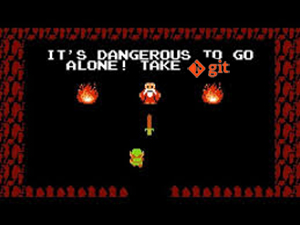
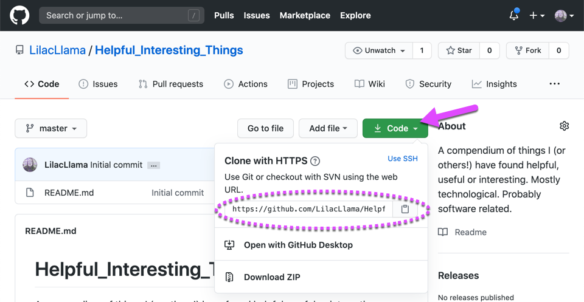
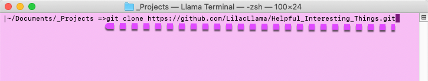
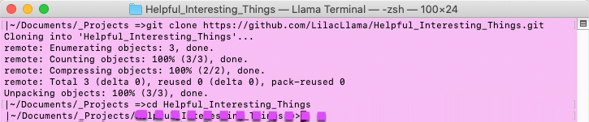
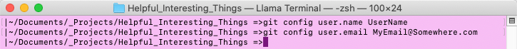

# The Solo Git Workflow

## What is this?

Aha! This is a simple walkthrough of what you should expect to see during a normal solo developer work flow when working with Git on your commandline (and in this case, screenshots are from a mac). This means we aren't covering installations, merge conflicts or other fancy things - this is literally just the basics of the general steps to follow and how to know which ones to take.

## Requirements
- Make sure you have [Git installed](https://git-scm.com/book/en/v2/Getting-Started-Installing-Git).
- Also, have a local repo cloned / ready for work. An empty one created on GitHub will do just fine.
    1) Find the repo link information in GitHub under the code button in the repository page.
    

Expand for visual example...

    2) In your terminal and use `git clone <your-repo>` to clone it locally. (I recommend putting it in a central location like a `Project` folder under your `Documents` folder)
    
    

Expand for visual example...

    3) Wait for the repo to copy local, and then navigate into the repo! Using the `cd` command should work here.
    
    

Expand for visual example...

- Before you get to work, make sure that your user settings are configured (you can set those up to be global, or you can set them for each repo) - this way you can be sure to clearly label your ownership of your commits.
    1) To set your username use: `git config user.name "YourUserNameHere"`
    1) To set your email use: `git config user.email "YourEmailHere"`
    
    

Expand for visual example...

# The Workflow
The repo we configured above is the one we are going to use in the following example, but you can reuse this same workflow for any other locally cloned solo-work repository.

## The Steps to the Flow

1.  Every commit starts with making changes.
    *   This means creating or modifying files withing the repository.
    *   When you're done with the changes, save the files and get ready to *stage* them ithin the repository.
2.  Use `git add` to stage your changes
    *   In your terminal, use the command `git status`
    *   If the status reports **red** text, that means there are modifications that you must `git add` to let git know you'll want these files as part of your commit!
    *   use the command `git add --all .` to add all files to the staging area.
3. Commit the added files with the `git commit` command.
    *   In your terminal, use the command `git status`
    *   If the status reports **green** text, there are files that have been _staged_ and are ready to be committed (assuming you're okay with that!)
    *   use the command `git commit -m "A message about your changes"` to commit your files to a save point.
4.  Use `git push` to move your changes to GitHub
    *   In your terminal, use the command `git status`
    *   If the status report has no red or green text, and mentions you being ahead by a # of commits - you can either go ahead and `push` your work to the server, or go back and make more changes and add & commit. 
    *   use the command `git push origin master` to push all your changes up to the server repository.
5.  Double check your status w/ `git status` before starting again!
    *   In your terminal, use the command `git status`
    *   If it says you're up to date w/ the server, you're good to start coding again!
    *   When you have new changes to save, go back to step 1, and add/commit/push all over again!

# Other Resources
* [Oh Shit Git](https://ohshitgit.com/) - a great compendium of problems and how to fix them!
* [Visualizing Git](https://git-school.github.io/visualizing-git/) - this is an awesome browser sandbox to help you more visual learners see how git is working.